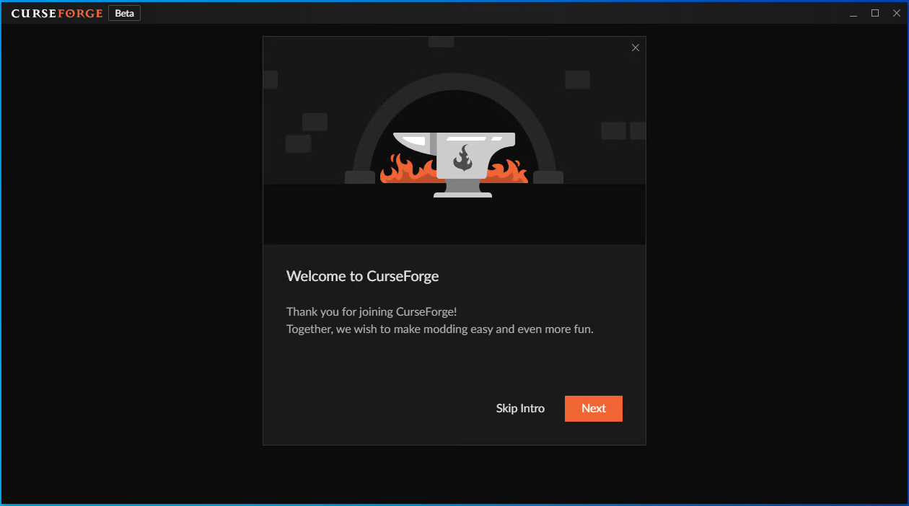
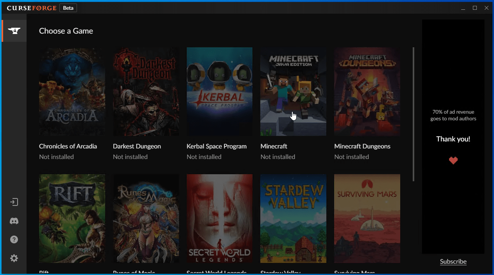
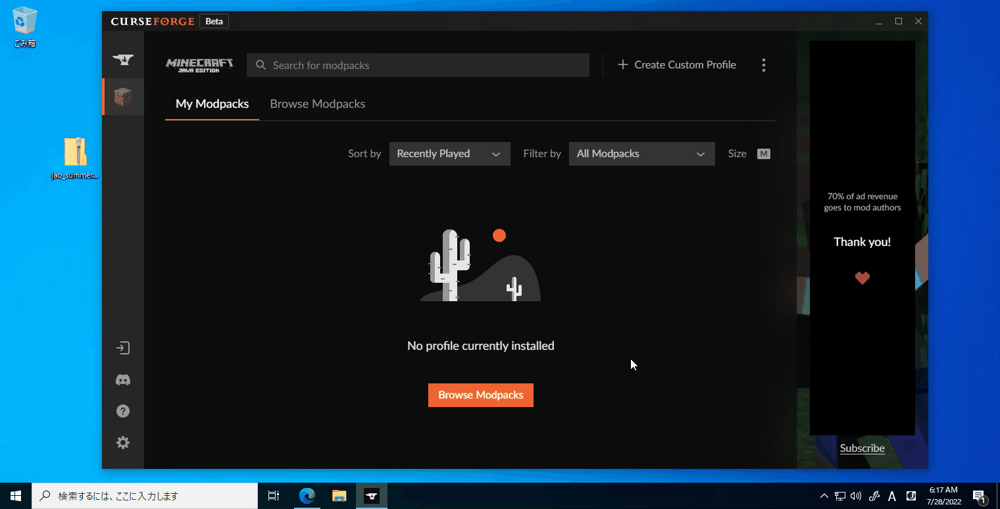

# プレイするまでの手順

## 1. CurseForge をインストールする

本イベントでは、ModPack を CurseForge という Mod 管理ツールを用いて作成しています。

[ダウンロードページ](https://download.curseforge.com/)にアクセスし、CurseForge のインストーラーをダウンロード、インストールしてください。

## 2. CurseForge を起動する

インストールした CurseForge を起動してください。

画像のようなウェルカムページが表示されます。イントロはスキップしてかまいません。

## 3. CurseForge 内で Minecraft をインストールする

CurseForge で Mod を管理するためには、CurseForge 内で Minecraft をインストールする必要があります。  
`Choose a Game` 画面で `Minecraft` を選び、インストールしてください。

この際、`Set up CurseForge's Minecraft modding folder` という Mod フォルダを指定する画面が表示されますが、`Standard` のまま `Continue` で進んでしまってかまいません。

## 4. プロファイルを作成する

まず、jMS Gamers Club の `#202208event` で公開されている CurseForge ModPack をダウンロードする必要があります。  
`jao_summer_survival-x.x.x.zip`という形式で投稿されている Zip ファイルをダウンロードしておいてください。

CurseForge に戻り、`Create Custom Profile` -> `Or import a previously created profile` の `import` と進み、先ほどダウンロードした Zip ファイルを選択してください。  
`jao summer survival` としてプロファイルが作成できたら成功です。

## 5. Minecraft を起動する

`Play` ボタンを押すことで、ModPack が適用された Minecraft を起動することができます。  
通常の Minecraft とインストール先が違うので Microsoft アカウントへのログインが要求されます。ログインしてください。

あとは普通に Minecraft を起動するだけです。

---

サーバアドレスなどは jMS Gamers Club の `#202208event` のピン止めメッセージにて公開されていますので、そちらを参照してください。
